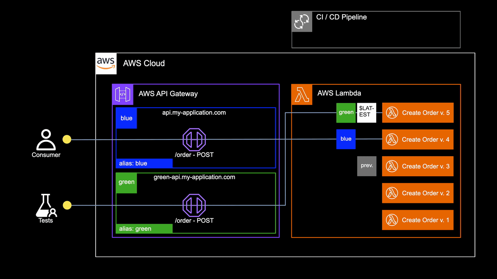

# AWS API Gateway + Lambda Blue/Green Deployment Reference Implementation

A reference implementation of a blue/green deployment strategy using **AWS API Gateway stages** and **Lambda function aliases**, built as a companion to a conference talk for [AWS Midwest Community Day 2026](https://www.midwestcommunityday.com).

## Overview

Blue/green deployment is a release strategy that reduces risk by running two identical production environments — **blue** (current) and **green** (new) — and shifting traffic between them only after the new version has been validated.

This project demonstrates how to implement that pattern on AWS using API Gateway and Lambda.

## Key Components

If you attended the talk, these are the steps that I walked through. If you didn't attend, these are the key components to understand how the blue/green deployment strategy is implemented in this project.

If you are updating an existing API Gateway + Lambda application that uses something like in-place deployments, follow these steps to implement the blue/green deployment strategy.

### API Gateway Stages

Your API Gateway may only have one stage today. With this approach, two API Gateway stages are needed, `blue` and `green`, each with a stage variable named `alias` that is the same as the stage name.

The API Gateway stages should have lifecycle rules configured to prevent automatic deployment on API changes, so that deployments are only triggered by the CI/CD pipeline after the new version is ready.

[api-gateway.tf](iac/api-gateway.tf) contains the API Gateway configuration, including the stage variables and lifecycle rules.

### Lambda Versioning

This is a simple opt-in (set `publish = true` on the Lambda function resource in Terraform) to enable versioning for each Lambda function. This allows us to create immutable versions of the Lambda functions that can be referenced by aliases.

[lambda-function/main.tf](iac/modules/lambda-function/main.tf) contains the Lambda function configuration, including versioning.

### Lambda Aliases

Three Lambda function aliases are needed with this approach: `blue`, `green`, and `previous`. The `blue` alias points to the currently live version, the `green` alias points to the latest deployed version for testing, and the `previous` alias points to the last live version before the current one.

`blue` and `previous` should have lifecycle rules configured to prevent being updated by Terraform, since they should only be updated by the CI/CD pipeline during promotion. `green` should be updated by Terraform during deployments.

> [!NOTE]
> The `previous` alias is optional, but it provides a quick rollback mechanism in case of issues with the new version.

[lambda-function/alias.tf](iac/modules/lambda-function/alias.tf) contains the Lambda alias configuration, including the `blue`, `green`, and `previous` aliases.

### API Gateway Integration

The API Gateway integration for each Lambda function should reference the `alias` stage variable in the Lambda function ARN, so that it dynamically invokes the correct version based on the stage.

For this demo, that invoke ARN has been added to the output of the Lambda function module, so that it can be easily referenced in the API Gateway integration configuration.

#### Lambda Permissions for API Gateway

The API Gateway needs permission to invoke the Lambda functions using the aliases. This is done by adding a permission resource for each alias.

Keep a permission for the `$LATEST` version. It doesn't do any harm, and prevents your API from temporarily breaking when first implementing this strategy.

[api-gateway-integration/gateway-integration.tf](iac/modules/api-gateway-integration/gateway-integration.tf) contains the API Gateway integration configuration, including the Lambda permissions for the aliases.

### CI/CD Pipeline

#### Deploying the Green Environment

The CI/CD pipeline should deploy the new version to the `green` environment first, and then run tests against it. If the tests fail, the pipeline should stop.

> [!NOTE]
> If you only have manual tests, add a manual approval step in the pipeline after deploying to `green`, and only proceed to testing and promotion after approval.

[build-deploy-and-promote.yml](.github/workflows/build-deploy-and-promote.yml) contains the GitHub Actions workflow for building, deploying, and promoting the new version.

#### Promoting to Blue

If the tests against `green` pass, the pipeline should deploy the new version to the `blue` environment, and then update the `blue` Lambda aliases to reference the versions referenced by `green`, and update the `previous` aliases to reference the versions that `blue` referenced before the update.

#### Cleaning Up Old Versions

After promotion, the pipeline should clean up any old Lambda versions that are no longer referenced by any aliases.

## Project Structure

| Path                                 | Description                                                                      |
|--------------------------------------|----------------------------------------------------------------------------------|
| `src/Ecommerce/`                     | .NET Lambda functions implementing a simple e-commerce orders API                |
| `test/Ecommerce.Api.Tests/`          | Integration test suite that validates the API end-to-end                         |
| `iac/`                               | Terraform infrastructure — API Gateway, Lambda functions, DynamoDB, ACM, Route53 |
| `schemas/`                           | JSON schemas for API Gateway request/response validation                         |
| `postman/`                           | Postman collection and environments for manual testing                           |
| `.github/workflows/`                 | GitHub Actions CI/CD pipelines                                                   |

> [!IMPORTANT]
> If you are going to run this project yourself, make sure to update the input variables in [`iac/terraform.tfvars`](iac/terraform.tfvars), and the configuration values in [`iac/config.tf`](iac/config.tf) with values that are appropriate for your AWS account and environment.

## API

The API is a simple CRUD orders service with four Lambda functions:

- `POST /v1/order` — Create order
- `GET /v1/order/{customerId}/{orderId}` — Get order
- `PUT /v1/order` — Update order
- `DELETE /v1/order` — Delete order

All endpoints are protected by a custom Lambda authorizer.

## CI/CD Pipelines

This project has two public-facing GitHub Actions workflows. In a real-world application, you would likely want to break these into additional workflows for better separation of concerns.

> [!WARNING]
> The Build & Deploy GitHub action automatically deploys Terraform without any manual approval step. This is intentional for demonstration purposes, but in a production environment you should implement an approval step before deploying infrastructure changes.

### Key Concepts

- IAC updates green, not blue.
- Tests run against green before promotion.
- Promote green to blue only after tests pass.
- Promotion is a control-plane operation, not a data-plane operation.

### [build-deploy-and-promote.yml](.github/workflows/build-deploy-and-promote.yml) — Build, Deploy and Promote

1. Builds the infrastructure using Terraform — creates new Lambda versions (referenced by the `green` alias) and updates the API Gateway configuration.
2. Deploys the API Gateway `green` stage and waits 60 seconds for the deployment to propagate.
3. Runs the integration test suite against `green` — if any test fails, the pipeline stops here.
4. Deploys the API Gateway `blue` stage and waits 60 seconds for the deployment to propagate.
5. Promotes each Lambda function's aliases: `blue` → version `green` points to, `previous` → version `blue` pointed to.
6. Runs the integration test suite against `blue` to validate the promotion.
7. Cleans up unused Lambda versions.

#### Branches that Demonstrate Different Scenarios

#### [`main`](https://github.com/OsborneSupremacy/api-gateway-bluegreen-demo/tree/main)

The main branch with the reference implementation. Deploying this branch will follow the standard blue/green deployment process and will succeed.

#### [`breaking-change-lambda`](https://github.com/OsborneSupremacy/api-gateway-bluegreen-demo/tree/breaking-change-lambda)

Simulates a breaking change in a Lambda function, causing the integration tests to fail. Deploying this branch will demonstrate the pipeline stopping at the test failure step, preventing promotion of a faulty version.

#### [`breaking-change-api-gateway`](https://github.com/OsborneSupremacy/api-gateway-bluegreen-demo/tree/breaking-change-api-gateway)

Simulates a breaking change in the API Gateway configuration, causing the integration tests to fail. Deploying this branch will demonstrate the pipeline stopping at the test failure step, preventing promotion of a faulty version.

## Notes

- The Lambda functions in this project are written in .NET, but the concepts are applicable to any language supported by Lambda.

- [test/Ecommerce.Api.Tests](test/Ecommerce.Api.Tests) is a regular .NET unit test project. This represents _any_ test suite that exercises and validates the functionality of the API.
    - I kept it the same framework as the API project for simplicity.
    - The test project deliberately is in a different solution than the API project and has its own copies of the request/response models and JSON schemas to ensure the tests are independent of the API implementation.

- [The custom authorizer Lambda function](src/Ecommerce/Ecommerce.Authorizer) is a naive implementation of an API Gateway custom authorizer.
    - It is not intended for production use.
    - It is included because this API Gateway is exposed to the public internet, and the authorizer offers some protection against unauthorized access.

## Q&A

### There's nothing novel about this approach. Why is a reference implementation useful?

Teams probably know that a blue/green deployment strategy is possible with API Gateway and Lambda. But like most new patterns, someone has to be the first to implement it and share the details. Without someone doing that, a theoretical good idea may not be adopted for a long time, if ever.

### Is this strategy needed if I have one or more lower environments before production?

Even when changes are tested in lower environments, there is still risk when deploying to production. The power of this approach is to be able to deploy to production and test before affecting live traffic, with production release being a low-risk, control plane operation.

### Is this strategy needed if my API Gateway uses versioning, e.g. leave `/v1/order` as it is and create `/v2/order` for new changes?

If you never update existing API Gateway Lambda integration functions, always deploying new versions to new API Gateway resources, then you woudn't need this approach.

However, that would mean that you never update existing Lambda functions -- no new features, bug fixes, security patches, etc.. You would have to create a new Lambda function and a new API Gateway resource for every change, notifying consumers to update to the new API endpoint, and then deprecating the old one.

### Is this strategy needed if I use feature flags in my Lambda functions?

With feature flags, code that's behind a feature flag is not invoked until the flag is enabled. Once it's enabled, all traffic to that Lambda function is hitting the new code, and if there are any issues with it, then all traffic is affected. Given that, feature flags _alone_ do not provide the same level of risk mitigation as a blue/green deployment strategy like this one.

### What about API Gateway canaries and Lambda weighted aliases?

Those features are generally more sophisticated than the blue/green approach demonstrated here. They can be used for more granular traffic shifting, but they also add complexity.

If a team is not doing any kind of blue/green deployment strategy today, this reference implementation is a simple way to get started with the concept, and then they can iterate and add more sophistication over time if needed.

### Are the names `blue` and `green` necessary?

No, the aliases and stages can be named anything. I would recommend using names that are also names of environments, to avoid overloading those names. e.g. if you have a `uat` and `prod` environment, do not name your API Gateway stages `uat` and `prod`.

I like `blue` and `green` because they rarely conflict with environment names, and within the AWS ecosystem, AWS services that support native blue/green deployment strategies use those names (e.g. [ECS](https://docs.aws.amazon.com/AmazonECS/latest/developerguide/deployment-type-blue-green.html), [Aurora](https://docs.aws.amazon.com/AmazonRDS/latest/AuroraUserGuide/blue-green-deployments-creating.html), [Elastic Beanstalk](https://docs.aws.amazon.com/elasticbeanstalk/latest/dg/using-features.CNAMESwap.html)).